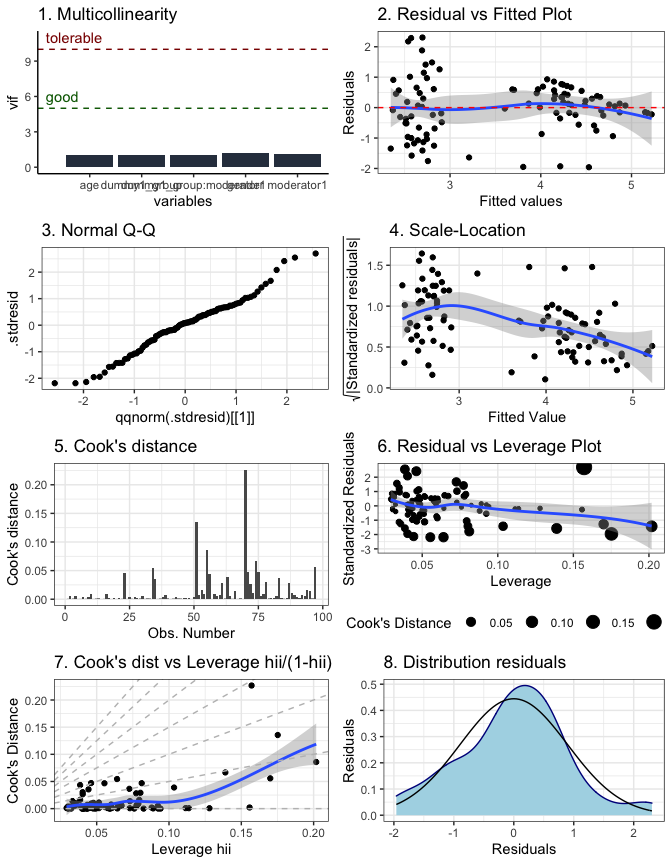

# CaviR 

[](https://github.com/cosimameyer/overviewR/actions)
[](https://www.repostatus.org/#active)
[](https://github.com/Watjoa/CaviR)
[](https://github.com/cosimameyer/overviewR)
[](https://www.gnu.org/licenses/gpl-3.0)
[](/commits/master)

> ‘Simplicity is the origin of everything’ - Tony Iommi (Black Sabbath)

The goal of CaviR is to make it easy to get a nice output of R codes
without coding too many detailed information. At the moment, there are
the following functions:

-   `coRtable` generates a correlation table with descriptive statistics
    and significance stars  
-   `lm.diagnostics` generates a visual overview of linear model
    diagnostics

## <i class="far fa-download"></i> Installation

To install the latest development version of `CaviR` directly from
[GitHub](https://github.com/Watjoa/CaviR) use:

``` r
library(devtools) # Tools to Make Developing R Packages Easier # Tools to Make Developing R Packages Easier
devtools::install_github("Watjoa/CaviR")
```

## Examples

First, load the package.

``` r
library(CaviR) 
```

### `coRtable`

To generate a correlation table with significance stars and descriptive
statistics, `coRtable` can be used. First, make a subset of the columns
in the order you want them to be displayed in the correlation table.

``` r
subset <- data[,c("Extra", "Agree", "Con", "Neur", "Open")]
```

Possibly, you can change the names of the variables by using
`colnames()`

``` r
colnames(subset) <- c('Extraversion','Agreeableness','Conscientiousness', 'Neuroticism', 'Openness')
```

Then, just run the `coRtable` function

``` r
coRtable(subset)
```

### `lm.diagnostics`

To generate an overview of all important diagnostics for a linear model,
`coRtable` can be used.

**Model assumptions: **

-   **Linearity**: is my model linear?

    -   *Check?*: (1) is the point cloud at random and (2) is the blue
        line in plot 2 similar to the horizontal line in *plot 2*?  
    -   *Violation?*: consider another relationship (e.g. cubric,
        curvilinear)

-   **Normality**: is the distribution of my parameters / residuals
    normal?

    -   *Check?*: do I have a Q-Q plot in *plot 3* where all datapoints
        are as close too the diagonal? Is the distribution as similar as
        possible to the normal distribution in *plot 8*?  
    -   *Violation?*: consider transformations of your parameters or
        check which variable is necessary to add to the model

-   **Homoscedasticity**: is the spread of my data across levels of my
    predictor the same?

    -   *Check?*: (1) is the point cloud at random and (2) is the blue
        line in plot 2 similar to the horizontal line in *plot 2*? (3)
        Is there a pattern in *plot 4*?  
    -   *Violation?*: in case of heteroscedasticity, you will have
        inconsistency in calculation of standard errors and parameter
        estimation in the model. This results in biased confidence
        intervals and significance tests.

-   **Independence**: are the errors in my model related to each other?

-   **Influential outliers**: are there outliers influential to my
    model?

    -   *Check?*: is the blue line in *plot 7* curved?  
    -   *Violation?*: this could be problematic for estimating
        parameters (e.g. mean) and sum of squared and biased results.

``` r
data$dummy1_group <- as.numeric(scale(data$Condition,scale=TRUE))
data$moderator1   <- as.numeric(scale(data$Indecisiveness,scale=TRUE))

model <- lm(outcome ~ dummy1_group*moderator1 + age + gender, data=data)

lm.diagnostics(model)
```



<!-- ## </a><i class="fas fa-table"></i> Why did we build it? -->
<!-- If you have a (large) data set that has many different observations over a long period, it becomes increasingly **difficult to identify for each unique observation its exact coverage in the data**. In particular, if some observations are not included for the entire time span of the data – either because they entered later, dropped out earlier or have gaps in between – it can become difficult to spot potential problems in your data’s time and scope. -->
<!-- overviewR allows you to **quickly get a glimpse of your data and the distribution of your observations over time**. With its ability to **produce both data.frame objects and LaTeX/.tex outputs**, it can be used by **practitioners and academics alike**. -->
<!-- ## <i class="fas fa-code"></i> How can it be used? -->
<!-- overviewR can be used by everyone who works with data that have **time-and-scope characteristics**. That is, all data that contains different units of observation over a specific period will benefit from overviewR. To get a quick overview of **which units** – think of countries, companies, test persons, etc. – **are present or missing during a given time span** – think of years, months, days, minutes, etc. – overviewR provides an **easy and intuitive insight** into the set-up of your data. -->
<!-- Consider a data set that covers countries over the past 50 years. **Not all countries existed throughout the entire period** – some dissolved, others were newly founded and yet for others, data might not be available for the entire period. Before starting any analysis, it is helpful to get an overview not only of which countries are included and what the entire time span is but also to **see which countries are present at which points in time**. In other words, are there missing data for certain countries at different points in time? -->
<!-- To get a quick and intuitive overview of your data, overviewR provides currently the following basic functions: -->
<!-- - **overview_tab** generates a basic table that lists all unique units of observation (e.g., countries) and aggregates the time frame at which each unit is present in the data set. This means it also takes into account gaps in the data set, e.g., when there is – for whatever reason – no data available for a country for a few years within the time frame -->
<!-- - **overview_crosstab** generates a similar table but allows you to separate the overview table using two conditions. For instance, you want to know not only at what time points countries are present in your data but also when these countries can be considered to have high or low GDP and can be categorized as having a small or large population size. For this, overview_crosstab is used. -->
<!-- overview_print takes a table – either generated by overview_tab or overview_crosstab and turns it into a LaTeX output. It even allows you to save the LaTeX output in a ready-to-use .tex file. -->
<!-- - **overview_plot** visualizes the time and scope conditions of your data in a ggplot plot. For each scope object in your data (e.g., countries) on the y-axis, it plots the time coverage (x-axis) as a horizontal line for all time points in your data. This helps to spot gaps in your data for specific scope objects or simply creates a graphical display of your time and scope conditions and can be a good companion for presentation slides or appendices. -->
<!-- overview_crossplot is an alternative to visualize a cross table (a way to present results from overview_crosstab) -->
<!-- - **overview_heat** visualizes the coverage of each time and scope combination of your dataset in a heat map style ggplot. Each cell in the heat map is colored based on the coverage of a scope object at a given time point. Additionally, it displays either the total number of cases covered or a relative percentage as plain text. This helps to spot missing information even more nuanced. For instance, in a monthly data set with countries as the scope object, it illustrates the percentage of covered months in the data for each country-year combination. -->
<!-- - **overview_na** graphically illustrates the total number of NAs across all variables in your data set as a horizontal bar plot. Similar to the other plot objects, overview_na returns a ggplot object and can be modified and adjusted accordingly. -->
<!-- ## <i class="fas fa-medal"></i> Projects using overviewR -->

# Credits

The hex sticker is generated by ourselves using the
[`hexSticker`](https://github.com/GuangchuangYu/hexSticker) package.
